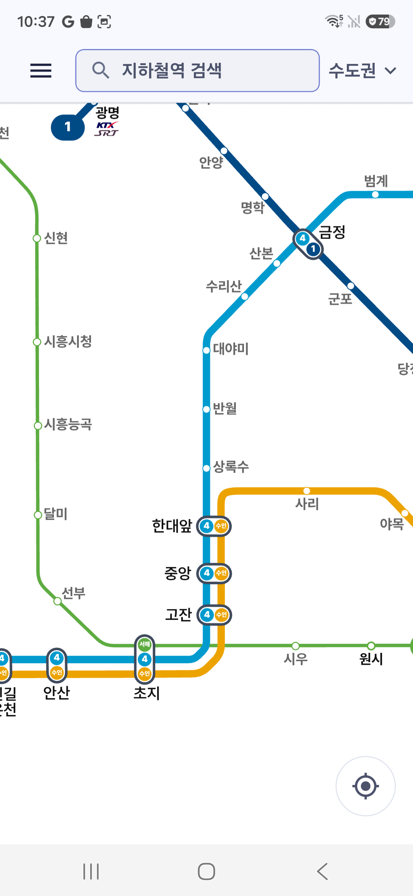
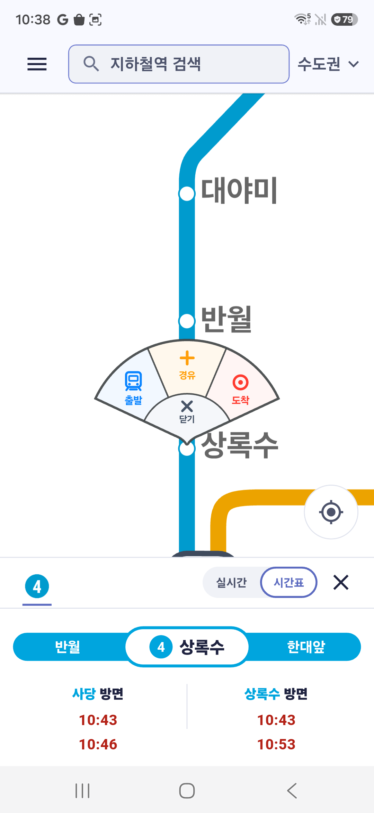

# 쉬운 지하철

[서비스 소개 보기 →](https://easysubway.aquilaxk.site)

## 빠른 길보다, 갈 수 있는 길.

계단 하나가 누군가에게는 벽이 됩니다.
 쉬운 지하철은 질문을 바꿉니다.
 **"얼마나 빨리"가 아니라, "갈 수 있는가".**

 

 

## 지하에서도. 인터넷 없이도.

역 검색도, 길찾기도 기기 안에서 끝납니다. 신호가 끊긴 지하 세 층 아래에서도.

## 당신의 상황이 곧 기준.

휠체어. 유모차. 불편한 걸음. 당신을 고르는 순간, 길이 달라집니다. 계단 없는 길이 먼저 옵니다.

## 아는 것과 모르는 것을 구분합니다.

모든 정보에 출처와 확인한 날짜가 붙습니다. 그리고 모르는 건, 모른다고 말합니다.

## 신고는 가입 없이.

엘리베이터가 멈췄다면 바로 알려주세요. 계정도 이름도 필요 없습니다. 접수 번호 하나면 충분합니다.

## 당신을 따라다니지 않습니다.

계정 없음. 추적 없음. 개인정보 판매 없음. 당신이 저장한 즐겨찾기는 당신의 기기에만 남습니다.

 

## 스크린샷

  
  

## 지금은

상록수·사당의 접근성 정보를 먼저 검증하고 있으며, 경춘선 ITX-청춘 길찾기는 출시 근거를 준비하고 있습니다.

## 다운로드

Android부터 시작합니다. Google Play 출시를 준비하고 있고, iOS는 그다음입니다.

출시 소식과 문의는 [aquila@aquilaxk.site](mailto:aquila@aquilaxk.site)로 보내주세요.

---

*계단 앞에서 막막했던 모든 순간을 위해.*

