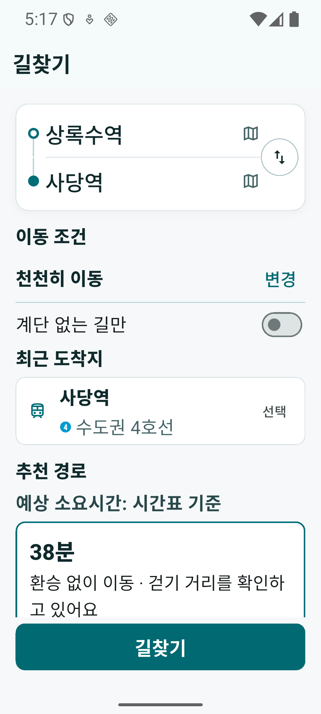

# #1415 Android PLANNED 증거

2026-07-10 Android emulator에서 상록수역 → 사당역 경로를 조회한 결과다. 화면과 UI tree 모두 `시간표 기준`을 노출하며, #1904가 적재한 KRIC pilot 시간표와 #1906이 검증한 RAPTOR `PLANNED` 경로의 모바일 표시 증거다.

- 화면: `planned-result.png` (`SHA-256 be56243767705c71803d1fd56ff42a137d8a7584d0d5c424eee3bb60b1e66a80`)
- UI tree: `planned-result-ui.xml` (`SHA-256 752df0d722cd73c81bbff2e0c30ae6f97af673cc8e76d4a9e5bc5867d8d9ac22`)
- 확인 문자열: `출발 상록수역`, `도착 사당역`, `예상 소요시간: 시간표 기준`, `약 38분 · 27.9km`
- 관련 검증: #1904 production pack 적재, #1906 stop_times↔RIDE 정합·RAPTOR planner 검증

이 증거는 #1415의 pilot `PLANNED` UI 종료 조건만 증명한다. 전국 시간표 coverage, realtime overlay, ENTRY/EXIT 접근성, 배포 완료를 주장하지 않는다.
